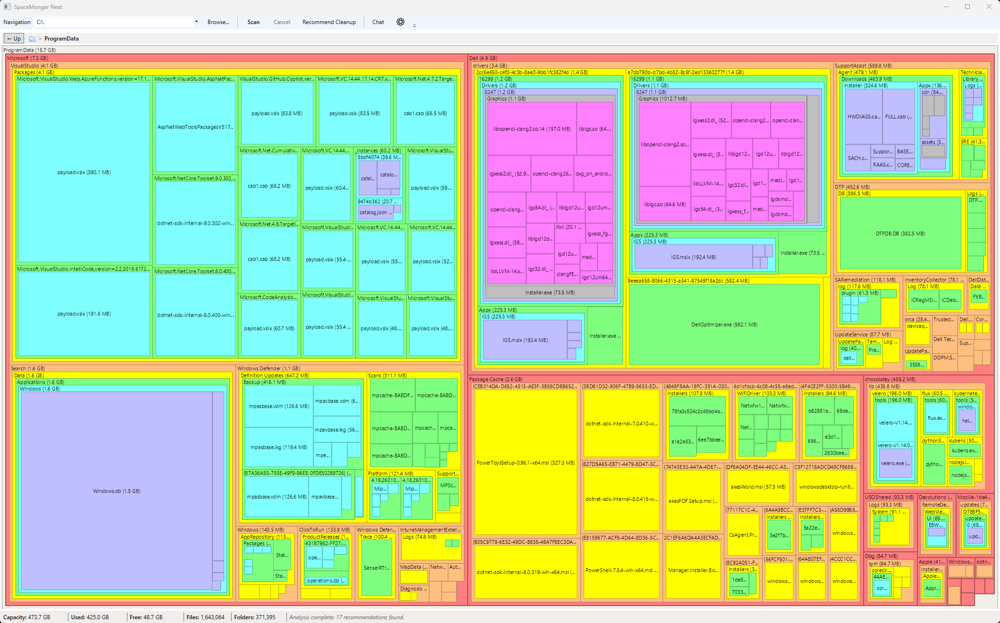
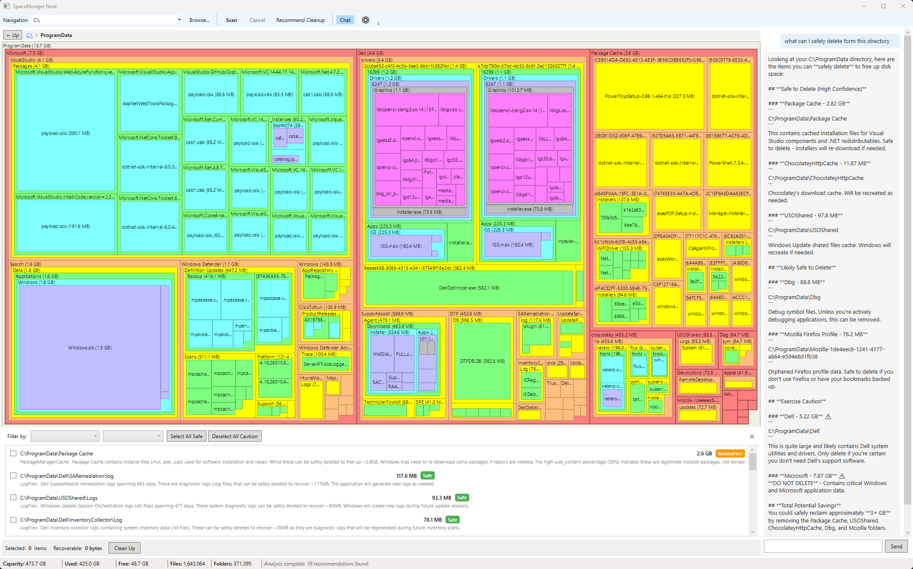

# SpaceMonger Next

A modern disk space analyzer for Windows inspired by the legendary [SpaceMonger](https://github.com/seanofw/spacemonger1), with AI-powered cleanup recommendations.

  

## About

SpaceMonger Next is a spiritual successor to [SpaceMonger](https://www.werkema.com/programming/the-spacemonger-1-x-post-mortem/), the brilliant treemap-based disk space visualizer created by **Sean Werkema** in 1997. The original SpaceMonger — written in a single afternoon and posted online by a college student — became one of the most beloved Windows utilities of its era. Its genius was in its simplicity: one glance at the treemap and you could instantly see where your disk space went. Even decades later, people still swear by it.

SpaceMonger Next carries that same philosophy forward — instant visual clarity about disk usage — and adds AI-powered analysis to help you decide what's safe to clean up.

*Treemap view of ProgramData — each rectangle is proportional to its size on disk. Colors distinguish folders at a glance, and you can click any rectangle to drill into that directory.*



*AI-powered cleanup in action — the right panel shows a chat conversation asking what can be safely deleted, with categorized recommendations and safety ratings. The bottom pane lists specific folders the AI flagged for cleanup, each with a size, safety rating (Safe, Review First, or Caution), and a description explaining why. Select items and click Clean Up to delete them in one step.*



**This project is not affiliated with or endorsed by Sean Werkema, Sixty-Five Software, Stardock, or EdgeRunner LLC.** It is an independent open-source reimagining built from scratch as a tribute to the original.

## Features

- **Treemap visualization** — squarified layout with the classic SpaceMonger color palette, proportional rectangles, and drill-down navigation
- **Free space indicator** — drive-level view shows free space as a distinct block so you see the full picture
- **AI cleanup recommendations** — sends file metadata to Claude and returns categorized suggestions with safety ratings (Safe / Review First / Caution)
- **Content-aware analysis** — the AI inspects file types, dates, and names inside ambiguous folders (like a folder named "Temp" that's actually full of important documents) instead of judging by name alone
- **Interactive AI chat** — ask questions about your disk usage with streaming token output
- **One-click cleanup** — select recommendations, confirm, and delete with automatic treemap refresh
- **Protected paths** — never recommends deleting OS files, system directories, or user document folders

## Prerequisites

- [.NET 8 SDK](https://dotnet.microsoft.com/download/dotnet/8.0) (or later)
- Windows 10 or Windows 11
- An [Anthropic API key](https://console.anthropic.com/) for AI features (optional — scanning and visualization work without it)

> **Cost note:** AI features (cleanup recommendations and chat) use the Anthropic Messages API, which is billed per token. There is no free tier or subscription-based OAuth option — Anthropic closed the third-party OAuth route, so API key with pay-per-use billing is the only supported authentication method.

## Installation

```bash
git clone https://github.com/your-username/spacemonger-next.git
cd spacemonger-next
```

## Build

```bash
cd src
dotnet build SpaceMonger.sln
```

## Run

```bash
cd src
dotnet run --project SpaceMonger.App
```

> **Note:** The application requires administrator privileges to access all directories. It will trigger a UAC elevation prompt on launch.

## Run Tests

```bash
cd src
dotnet test SpaceMonger.sln
```

## Usage

### Scanning

1. Select a drive or folder from the dropdown, type/paste a path, or click **Browse...** (which starts scanning immediately)
2. Click **Scan** to start — progress shows files and folders counted
3. The treemap fills in when the scan completes, with free space shown as an off-white block at the drive level
4. Click any folder rectangle to drill in, click **Up** or press **Escape** to go back
5. Clicking **Scan** while drilled into a subfolder rescans just that folder

### AI Cleanup Recommendations

1. Enter your Anthropic API key in **Settings** (gear icon)
2. Click **Recommend Cleanup** — the AI analyzes your scan and returns items it thinks you can safely remove
3. Recommendations are grouped by category (Temporary Files, Build Cache, Package Manager Cache, etc.) and rated by safety
4. Check items to select them, then click **Clean Up** to delete

> The AI only returns items it recommends for deletion. Files and folders it considers important are intentionally omitted from the list.

### Chat

1. Click **Chat** to open the side panel
2. Ask questions about your disk usage — the AI sees your current treemap view and any selected item
3. Responses stream in token-by-token

## Project Structure

```
src/
├── SpaceMonger.App/          # WPF application (UI layer)
│   ├── Controls/             # TreemapControl (SkiaSharp rendering)
│   ├── Converters/           # Value converters for XAML bindings
│   ├── ViewModels/           # MVVM view models
│   └── Views/                # XAML views (Chat, Recommendations, Settings, Treemap)
├── SpaceMonger.Core/         # Core library (no UI dependencies)
│   ├── Enums/                # Safety ratings, categories, etc.
│   ├── Models/               # FileEntry, TreemapNode, ScanSession, etc.
│   └── Services/
│       ├── Analysis/         # AI recommendation engine with content fingerprinting
│       ├── Chat/             # AI chat service
│       ├── Cleanup/          # File deletion service
│       ├── Llm/              # Anthropic API client (streaming + non-streaming)
│       ├── Scanning/         # File system scanner (single-pass enumeration)
│       ├── Settings/         # API key and app settings persistence
│       └── Treemap/          # Squarified treemap layout algorithm
└── SpaceMonger.sln
tests/
├── SpaceMonger.App.Tests/
└── SpaceMonger.Core.Tests/
```

## Technical Notes

- **File scanner** uses `FileSystemEnumerable<T>` which maps directly to `FindFirstFile`/`FindNextFile` — one syscall per entry with no extra `stat` calls
- **Cloud placeholder files** (OneDrive Files On-Demand) are detected and report 0 bytes to avoid triggering unwanted downloads during scan
- **Treemap layout** uses the squarified algorithm with adaptive depth — small directories become solid blocks rather than rendering unreadable children
- **AI metadata** is sent as a compact pipe-delimited format (~5-10x smaller than JSON) to maximize the data that fits within token limits
- **Content fingerprints** attached to ambiguously-named directories include file type distribution, date ranges, user-content percentage, and sample file names so the AI can make informed safety judgments

## Acknowledgments

This project exists because of the original **SpaceMonger** by [Sean Werkema](https://www.werkema.com/). SpaceMonger 1.0 proved that a great idea, well executed, can outlast decades of technology change. The treemap visualization concept, the color palette, the drill-down navigation, and the philosophy of "do one thing and do it well" all trace directly back to Sean's work.

- [SpaceMonger 1.4 source code](https://github.com/seanofw/spacemonger1) — preserved on GitHub for posterity
- [The SpaceMonger 1.x Post-Mortem](https://www.werkema.com/programming/the-spacemonger-1-x-post-mortem/) — Sean's own account of building SpaceMonger
- [Sean Werkema's Blog](https://www.werkema.com/) — includes additional SpaceMonger retrospectives

## License

MIT
